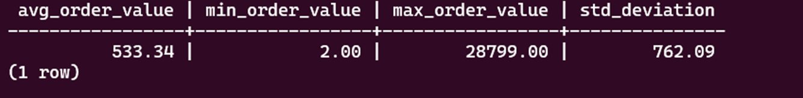

# CDE_Git_Linux Assignment for Circle 7

### Parch & Posey: Database EDA

1. #### DATABASE OVERVIEW

    Insight: Shows all tables with their row counts – Web Events is largest table.

2. #### ORDERS DATE RANGE

    Insight: Complete date range of all orders showing business duration.

3. #### ORDERS BY PAPER TYPE

    Insight: Standard paper dominates sales, gloss and poster are smaller segments.

4. #### TOP 10 ACCOUNTS BY SPEND

    Insight: EOG Resources is the top customer that contributes significantly to total revenue.

5. #### SALES CHANNEL PERFORMANCE

    Insight: Direct and Facebook channels drive most web traffic.

6. #### REGIONAL DISTRIBUTION

    Insight: Northeast region has most accounts and sales reps.

7. #### ORDER SIZE DISTRIBUTION

    Insight: Majority of orders size are Small.

8. #### MONTHLY ORDER TREND

    Insight: Shows monthly orders and revenue with the highest revenue form 2013-12 but the highest order from 2014-08.

9. #### AVERAGE ORDER VALUE

    Insight: Wide range of order values with high standard deviation.

